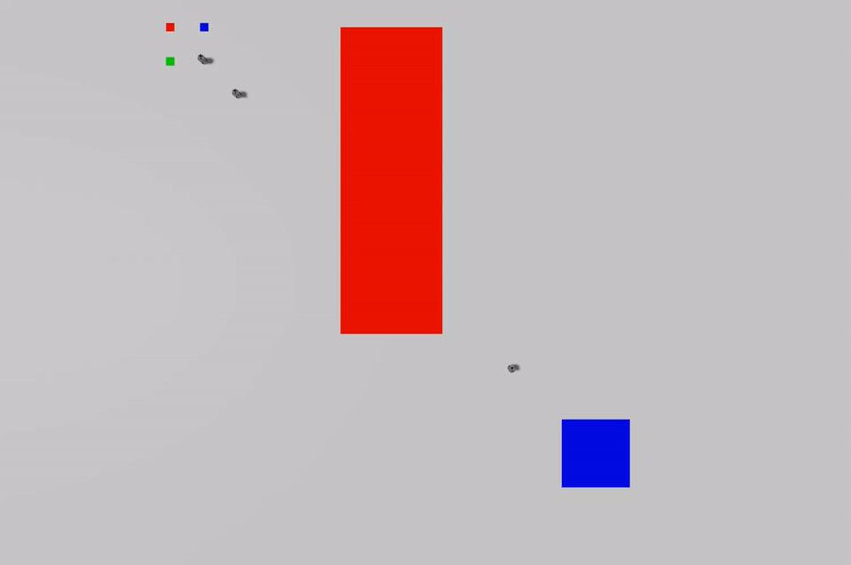

# inter_stl
Code for the paper "----"

The project page can be found [here](https://arian-kourangi.github.io/DA236X-Master-Thesis/).

This project is based on the paper "Collaborative Object Transportation in Space via Impact Interactions" by Joris Verhagen and Jana Tumova, you can find their original paper [here](https://arxiv.org/abs/2504.18667), the project page [here](https://joris997.github.io/impact_stl/) and the code [here](https://github.com/joris997/impact_stl).



# Before you start
The code, while being a ROS2 package in its entirety, consists of two distinct parts;
- `inter_stl/planner` which generates the desired motion plans and writes them to `.csv` files
- `inter_stl/inter_stl` which is the ROS2 package that reads the `.csv` files and executes them in SITL or on the real platform.

The only proprietary dependency is `gurobi` which is only required for `inter_stl/planner` to solve the Mixed-Integer Problem. If you do not want or cannot obtain a `gurobi` license, there are generated `.csv` files in `inter_stl/inter_stl/planner/plans` for all the scenarios described in the paper, and more!


# Installation
## Just the planner
If you have a `gurobi` license and you are interested in only generating the motion plans, you can build a virtual environment using the `environment.yml` file in `inter_stl/planner`

```
conda env create -f environment.yml
```


## The whole deal
To run the SITL or hardware simulations, I have provided a DockerFile in `DockerFiles`. This image requires approximately 15Gb of storage as it installs, among others, `ros2`, `gazebo`, and `px4-space-systems`.

```
docker build -t inter_stl:latest -f DockerFiles/Dockerfile . 
```

``` 
  docker run -it \
  --network=host \
  --ipc=host \
  -e DISPLAY=$DISPLAY \
  -e QT_X11_NO_MITSHM=1 \
  -v /tmp/.X11-unix:/tmp/.X11-unix:rw \
  -v /dev/dri:/dev/dri \
  -e XDG_RUNTIME_DIR=/tmp/runtime-root \
  -v /home/DA236X_Master_Thesis/inter_stl:/home/px4space/space_ws/src/inter_stl \
  --name inter_stl_cont \
  inter_stl:latest 
  ```

The last argument links your local clone of the `inter_stl` package (not the repository) to the Docker container. You can change the path to your local clone of the package.

After creating the container you can run it with 
```
docker start -ai inter_stl_cont
```
And attach more shells using 

```
docker exec -it inter_stl_cont /bin/bash 
```

Finally, to ensure we get the correct ros packages and gazebo worlds 
```
cp -f -r ~/space_ws/src/inter_stl/resource/my_msgs/ ~/space_ws/src/ 
cp -f -r ~/space_ws/src/inter_stl/resource/px4-offboard/ ~/space_ws/src/ 
cp -f -r ~/space_ws/src/inter_stl/resource/worlds/frictionless_kth* /home/px4space/PX4/PX4-Space-Systems/Tools/simulation/gz/worlds 
```
# Running the code
## Planner
To run the planner, you need to activate the conda environment and run the `main.py` script. 
The script allows you to change robustness type and scenario. See the `World.py` and `Spec.py` for details on how to change the scenarios. 

In the `inter_stl` directory, run the following commands:

```conda activate impact_stl```

```python main.py```

## Simulation
The simulator requires several components to be running. We list them here:
- `QGroundControl` which is the ground control station for the PX4 autopilot, allowing us to arm, disarm, and change the control mode of the vehicle.
- `microros` which is the micro-ROS agent that allows us to communicate with the PX4 autopilot.
- `sitl launch file` which is the launch file that starts the PX4 autopilot in software-in-the-loop (SITL) mode.
- `scenario launch file` which is the launch file that starts the all the controllers, planners, impact detectors etc.
- `start launch file` which sends the global signal that the simulation should start. Also records the rosbag.

### QGroundControl
In the home directory, run the following command to start QGroundControl:
```./startQGC```

### Micro-ROS
In any directory, run the following command to start the micro-ROS agent:
```ros2 run micro_ros_agent micro_ros_agent udp4 --port 8888```

### SITL launch file
Go to the `space_ws` directory, and build the workspace:
```colcon build --symlink-install```

Source the workspace:
```source install/setup.bash```

Then, run the following command to start the PX4 autopilot in SITL mode:
```ros2 launch inter_stl sitl_test1.launch.py```

### Scenario launch file
Run the following command to start the MPC and the planners:
```ros2 launch inter_stl test1.launch.py```

Open QGroundControl, change to "Multi-Vehicle" and change mode from "Hold" to "Offboard" for vehicle 1 and 2.
### Start launch file
Run the following command to start the simulation:
```ros2 launch inter_stl start_scenario.launch.py```

### Additional Scenarios
There are 6 total scenarios, out which 1-5 are currently working well. The final scenario called final_test highlight some of flaws that are still present in the stack.

# Citation
If you found this code useful, please consider citing my paper or the original:


```bibtex
@article{kourangi2026tetherless,
  title={Collaborative Object Transportation in Space via Impact Interactions},
  author={Kourangi, Arian},
  journal={arXiv preprint arXiv:2504.18667},
  year={2026}
}
```

```bibtex
@article{verhagen2025collaborative,
  title={Collaborative Object Transportation in Space via Impact Interactions},
  author={Verhagen, Joris and Tumova, Jana},
  journal={arXiv preprint arXiv:2504.18667},
  year={2025}
}
```